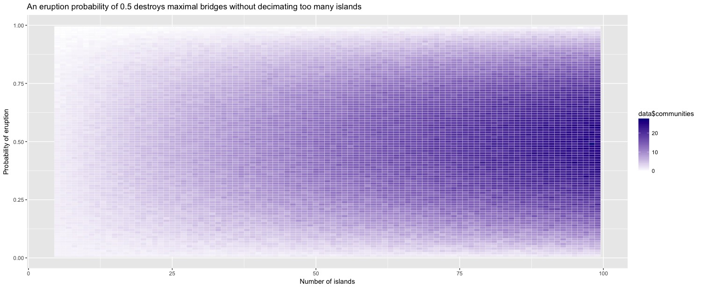

#Archipelago

### Topline conclusion: The most disjointed communities will be left if islands collapse with probability 0.5. On average across all probabilities, we expect about `0.18n` communities to remain, where `n` is the original number of islands.

## [The Challenge](https://fivethirtyeight.com/features/so-your-archipelago-is-exploding-how-doomed-is-your-island/)

From Ricky Jacobson and Ben Holtz, geological disaster looms beneath:

You live on the volcanic archipelago of Riddleria. The Riddlerian Islands are a 30-minute boat ride off the shores of the nearby mainland. Your archipelago is connected via a network of bridges, forming one unified community. In an effort to conserve resources, the ancient Riddlerians who built this network opted not to build bridges between any two islands that were already connected to the community otherwise. Hence, there is exactly one path from any one island to any other island.

One day, you feel the ground start to rumble — the islands’ volcanoes are stirring. You’re not sure whether any volcano is going to blow, but you and the rest of the Riddlerians flee the archipelago in rowboats bound for the mainland just to be safe. But as you leave, you look back and wonder what will become of your home.

Each island contains exactly one volcano. You know that if a volcano erupts, the subterranean pressure change will be so great that the volcano will collapse in on itself, causing its island — and any connected bridges — to crumble into the ocean. Remarkably, other islands will be spared unless their own volcanoes erupt. But if enough bridges go down, your once-unified archipelagic community could split into several smaller, disjointed communities.

If there were N islands in the archipelago originally and each volcano erupts independently with probability p, how many disjointed communities can you expect to find when you return? What value of p maximizes this number?

## Workflow
Once again, I eschewed theoretical underpinnings and built a little simulator! This is a neat problem in graph theory, where the island/bridge setup can be represented by a [tree](https://en.wikipedia.org/wiki/Tree_(graph_theory)). Once that decision is made, the strategy for setting up the experiment is pretty simple.

I made use of the excellent [NetworkX](https://networkx.github.io/documentation/latest/_downloads/networkx_reference.pdf) Python package to set up the tree randomly. Then, I iterated through every node in the tree and destroyed it with probability `p`. I ran this experiment 20 times each for a range of probabilities between 0.01 and 0.99 and island numbers from 5 to 99, collecting the results in a very tall CSV.

## Results

Then I popped over to R so I could use `ggplot` to create a visualization. A heatmap seemed like the best way to capture what is essentially a 3-dimensional dataset. The symmetry of the plot around `p = 0.5` underscored my original assumption, which was to strive for a balance between separating as many communities as possible without eliminating too many islands in the process.

Across all probabilities, for an original configuration with `n` islands, the mean number of communities remaining was about `0.18n` and the median was about `0.2n`. So if you started with 50 islands in general, the expected number of isolated communities after the eruptions would be 10.

I really enjoyed getting to use a graph library; definitely curious to see what other simulations I could make with graphs. One thing that would have made this challenge even more interesting would be some kind of stochastic ripple effect. Maybe I'll add that in and see how it effects the results.

