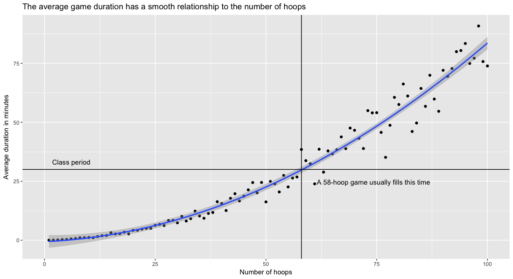

# RockPaperScissorsHop

## [The challenge](https://fivethirtyeight.com/features/how-many-hoops-will-kids-jump-through-to-play-rock-paper-scissors/)

Let’s call this game rock-paper-scissors-hop. Here is an idealized list of its rules:

Kids stand at either end of N hoops.
  - At the start of the game, one kid from each end starts hopping at a speed of one hoop per second until they run into each other, either in adjacent hoops or in the same hoop.
  - At that point, they play rock-paper-scissors at a rate of one game per second until one of the kids wins.
  - The loser goes back to their end of the hoops, a new kid immediately steps up at that end, and the winner and the new player hop until they run into each other.
  - This process continues until someone reaches the opposing end. That player’s team wins!

You’ve just been hired as the gym teacher at Riddler Elementary. You’re having a bad day, and you want to make sure the kids stay occupied for the entire class. If you put down eight hoops, how long on average will the game last? How many hoops should you put down if you want the game to last for the entire 30-minute period, on average?

## Workflow

At first, I wanted to proof this out, but I am simply not a theorist (although I'll keep trying!). The one insight I did get from the purely mathematical work was that one rock, paper, scissors (RPS) match should take on average 1.5 seconds. Indeed, that was backed up in practice. If there were no hoops separating the first two children, the game of RPSHop lasted about 1.5 seconds on average.

The Python script is a pretty straightforward simulator. Everything is wrapped in an `iterate()` function and the simulation can be run as many times as the user wants. Thus, the script has parameters `maxHoops` and `Ntrials`, and will write out a CSV containing the average time over `Ntrials` for games with sizes form 0 to `maxHoops`.

Then I wrote an R script that could read in the results of the Python simulation and plot it. Immediately, I saw a relationship that looked quadratic. Using ggplot, I fit a quadratic curve to the data and marked the 30-minute cutoff.

I did one big test of 50 trials each for games up to 100 hoops and plotted the results here:

