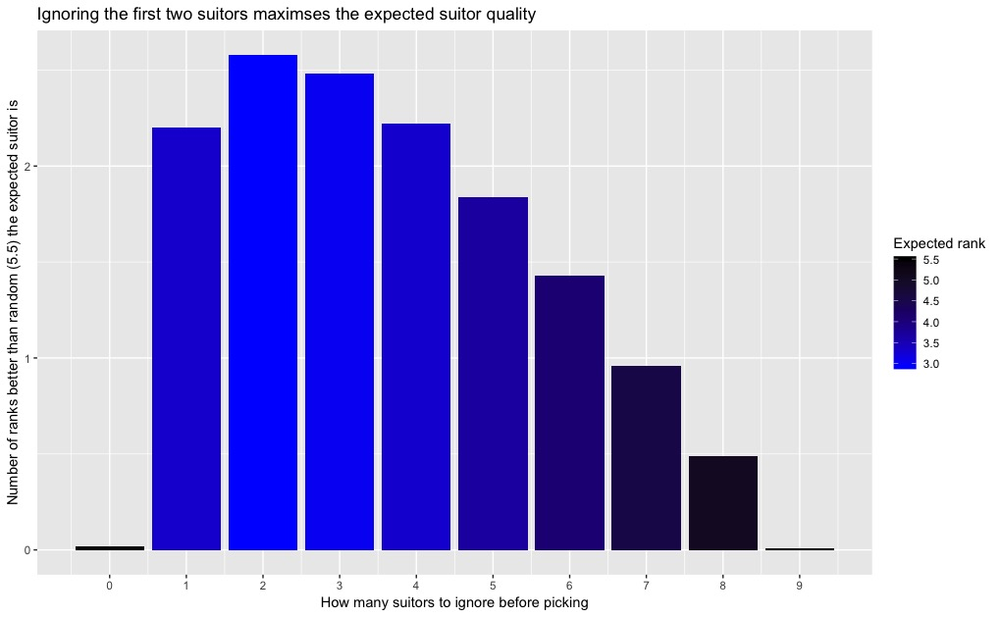
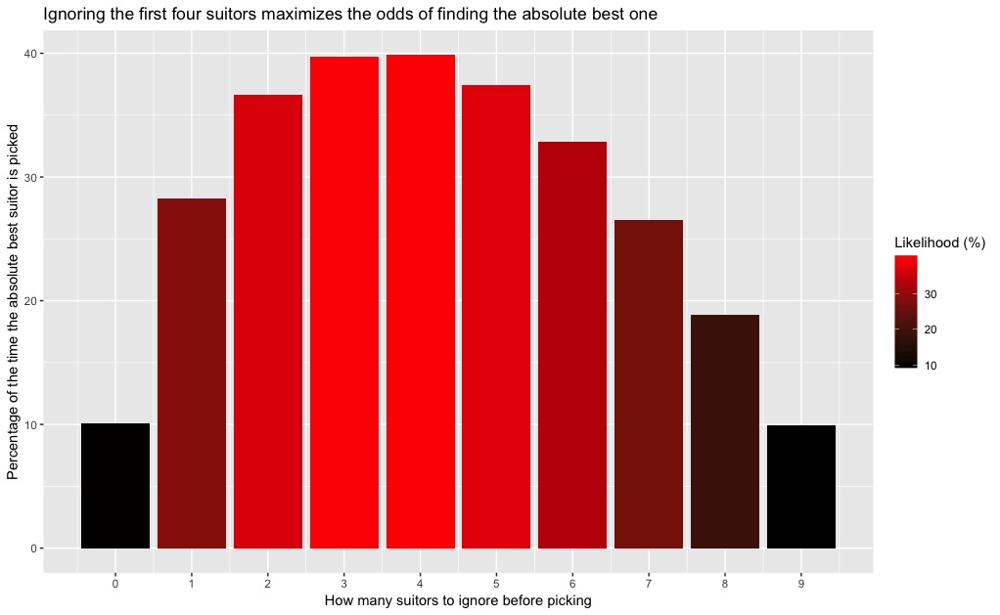
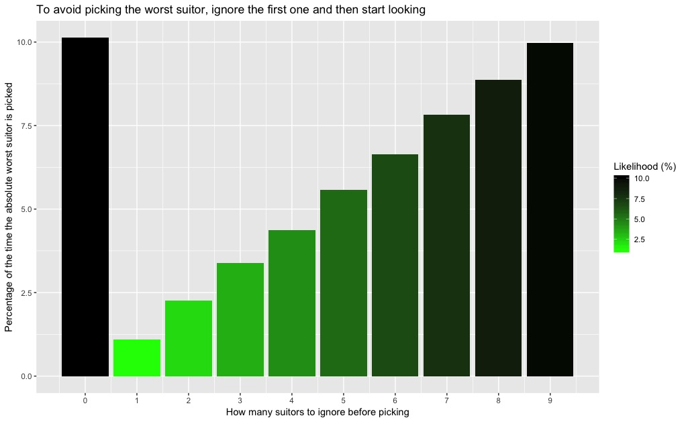

# SultonSuitors

### The topline conclusion: If the goal is to maximize the expected quality of the suitor, the optimal strategy is to ignore the first 2 suitors, then accept the first suitor among the remaining 8 whose rank is better than either of those first 2. If the gaol is to maximize the odds of ending up with the absolute best suitor, the optimal strategy is instead to ignore the first 4, then pick the first one among the remaining 6 whose rank is better. To avoid the absolute worst suitor, ignore only the very initial one, and then pick the first suitor whose rank is better.

## [The challenge](https://fivethirtyeight.com/features/how-long-is-the-snails-slimy-trail/)

From Julien Beasley, a new spin on the [Sultan’s Dowry Problem](http://mathworld.wolfram.com/SultansDowryProblem.html), a classic problem of matrimony:

The sultan has asked her vizier to present her with 10 candidates for marriage. The vizier has searched the kingdom for the 10 most desirable partners, but he does not know whom the sultan will prefer. If she saw them all at the same time, she would easily be able to rank them from 1 (the best partner) to 10 (the worst partner). But the vizier can only present the candidates one at a time — very hard to sync everybody’s calendars, even back then — and in a random order. Upon seeing each candidate, the sultan must reject or accept him. If a candidate is rejected, the sultan cannot pick him again. But on seeing each new candidate, she knows exactly where he’d stack up relative to the candidates she has rejected. If she strategizes, what’s the highest rank she can expect her chosen candidate to have on average?

For example, if she simply accepted the first candidate presented to her, his rank could be anywhere from 1 to 10 with equal probability, averaging to 5.5. Surely she can do better…

## Workflow

Phew! It's been quite a while since I've dusted off my Riddler boots, but this one seemed ripe for a little Python simulation. At first glance, it wasn't intuitive to me what the right strategy would be. Like, if the best suitor was the first person you saw, you'd have no way of knowing that you wouldn't see anyone better.

### The theoretical solution

Well, that dilemma turns out to be the whole basis for the solution. If you read the Wolfram MathWorld article linked to above, you'll see that the optimal strategy in this problem is to pick a value, let's call it `w`. Then your algorithm looks like this:

  - For the first `w` suitors, keep track of who is the best one you've seen so far, but don't actually consider picking any of them.
  - Then, for the `w + 1`th suitor that you see, consider the following:
    - If suitor `w + 1` is better than the best suitor you've seen so far, pick them immediately
    - Otherwise, keep looking
  - If you get to the end, of course, you have to pick the last suitor, which is an equivalent strategy to picking the first one

In a broad, scientific sense, you can think of this algorithm boiling down to an **exploration phase** and an **exploitation phase**, which is a framework you'll run into in lots of problems where you have limited information (can't know the absolute ranks of suitors) and limited time (only get to consider each suitor once). If you spend more time in the exploration phase, you will end up with better information, but less opportunity to use it. If you don't explore much, you have more opportunity to exploit your knowledge, but that knowledge may have crucial gaps. *(any kind of A/B testing, or really any experiment at all, has constraints like these)*

So the question becomes this: how do you find the right value for `w` given an `n`, where `n` is the number of suitors? Well, long story short, you can prove mathematically that it's around `n/e`, where `e` is Euler's constant: `2.718... and all the rest`. In our case, `n` equals 10, which is pretty small, so the actual answer will be a little lower. We could prove it out on paper, but that's not how we do things around here!

### The experiment
The attached Python script, `pickSuitor.py`, implements the above algorithm, with a few extra bells and whistles for analysis. Here's the experiment it runs:
  - Randomly shuffle the numbers 1 through 10, representing the suitors
  - Go through the numbers one at a time, only storing the lower one seen so far
  - After `w` numbers, keep an eye out for a number that's lower than the current lowest and return it immediately if found
  - If such a number never arrives, return the last number seen
  - In either case:
    - If the number being returned is 1 (best suitor), return an extra "Top Suitor" flag
    - If the number being returned is 10 (worst suitor) return an extra "Bottom suitor" flag
    - If the number being returned is 5 or lower (top half), return an extra "Positive outcome" flag

It does this 100,000 times with `w` values between 0 (pick the first suitor) and 9 (pick the last one) and tabulates the average ranks of the suitor it picked, as well as the totals of top suitors picked, bottom suitors picked, and positive overall outcomes.

### The results

I used my usual R/ggplot setup to have a look at the results. As we can see, the optimal strategy for maximizing the *expected quality of our suitor* is pretty clear:

There's an interesting asymmetry here that I want to explore further (see below). Additionally, what if we changed our victory condition a bit, such as *maximizing the likelihood that we got the best suitor*?

If you look at the raw data, you can see why this is a little different from the first plots. `w` values of 3 and 4 have "Expected Suitor Quality Scores" very close to `w=2`, but higher standard deviations. This means they're more likely to yield an ideal outcome, but also more likely to yield a disastrous outcome:

This plot is really cool, because it illustrates the exploration / exploitation tradeoff in a completely linear way (with the exception of the "always pick the first one" strategy). Bear in mind that there are **two** ways to **not** pick the best suitor: they could be one of the ones you ignored, **OR** they could be behind someone you pick "prematurely." But there's only **one** way to pick the worst suitor: they are the very last one you see, **AND** you saw the absolute best one during the exploration phase, so you refuse to pick anybody else by the time you get to the end. The risk of spending too much time in the exploration phase is huge, here, because there is a guaranteed 10% chance that the worst suitor will be the last one you see, so the longer you explore, the more likely you are to see the best suitor and get "locked out" of picking any others.

In fact, the more I think about it, the more I realize how important the green plot is. While the "best suitor" plot is basically symmetric, this one is linear. You can think of the "expected" suitor case (the blue plot) as a combination of these two, in a way. The symmetric and asymmetric plots combine to form one that still makes a nice bell curve, but is skewed toward less information, more exploitation. Who knew that information could be so debilitating! 
